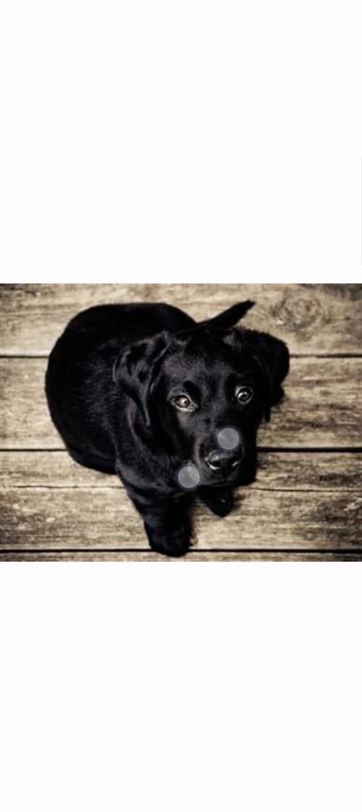
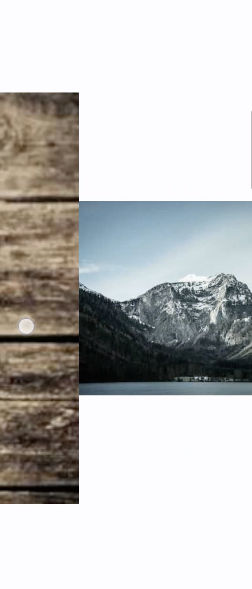

# Touchable image 
This is a sample project that shows zoom and scroll custom image on Compose. And it can controll if it comsume gesture when it is on horizontal pager. 

# Description

## TouchableImageView

|Param|Description|
|------|---|
|imagePath|image url path. |
|onError|show view when occur error when load image. |
|contentDescription|Text used by accessibility services to describe what this image represents. This should always be provided unless this image is used for decorative purposes, and does not represent a meaningful action that a user can take. |
|contentScale|Optional scale parameter used to determine the aspect ratio scaling to be used if the bounds are a different size from the intrinsic size of the AsyncImagePainter. |
|minScale|min value of scale. |
|maxScale|max value of scale. |
|isVisible|visible value. if it visible, reset state value. |

----------------

## TouchableState
it control scale and offset value on view. 

|Fuction|Description|
|------|---|
|startGesture()|detect gesture when user touch down pointer. |
|changeGesture()|after touch down, user can move pointers everywhere. calculate how much it could move and zoom. |
|onEndGesture()|detect point after touch up. it contains animation. so it make more natural gesture. |
|reset()|reset scale, zoom value. |
|canConsume()|This method detect whether it can consume. if it not use this functino, it consume all gesture especially when image is on pager. image has `pointerInput()` that consume all gesture. |
|zoomIn()|when user tap double times, it do automatically zoom. 1f -> 2f -> 3f. | 

|State|Description|
|------|---|
|imageSize|origin image size. |
|layoutSize|parent layout size. it need to calculate how max distance we move. |
|scale|image scale value. it is between minScale and maxScale. |
|offsetX|image offset X. we set how much we move to. if it out of boundary, it go back to max X position using animation. |
|offsetY|image offset Y. |
  

## Sample Video

### Single image version

### Horizontal pager version

